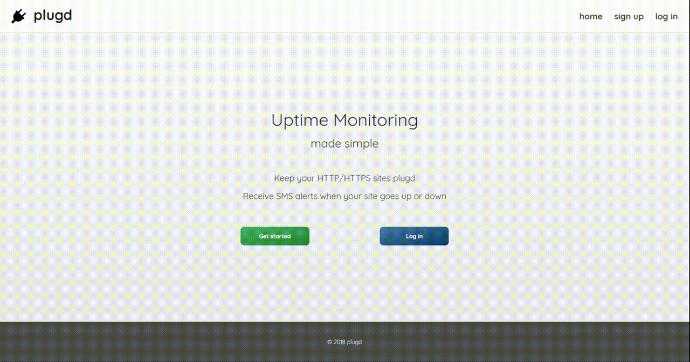

# plugd

Monitor uptime for multiple sites, receive SMS alerts on status change. User checks are customizable. All checks run every minute. Based on course project built for Pirple's excellent [Node.js Master Class](https://pirple.thinkific.com/courses/the-nodejs-master-class). Features CLI for server management.

  

